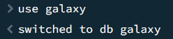
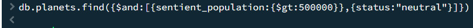
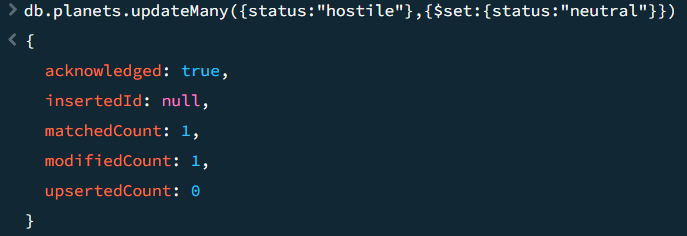
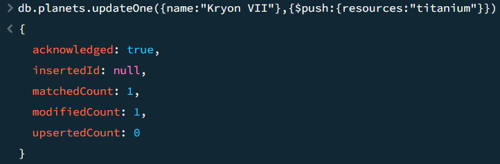
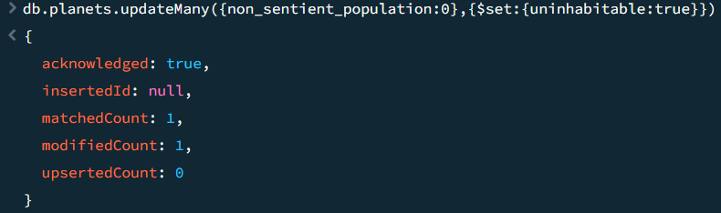
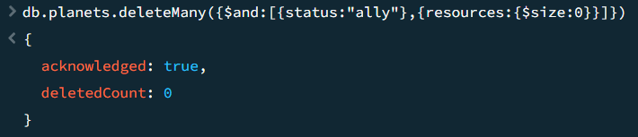
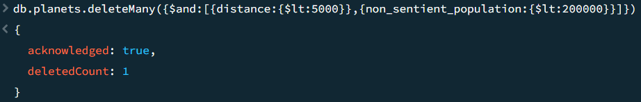

# Mongo_Galaxy

---

**=> journal_entry_number_01_|02/04/2587|: <=**

Je suis un simple ouvrier qui s'occupe de la base de données de la flotte spatiale: **MONGOSPACE**. Je dois donc commencer par créer une base de données pour y enregistrer toutes les informations concernant les différentes planètes visitées.

---

## Création de la base de données

Pour la création de la database j'utilise ici la commande use qui me permettra de me déplacer sur la bdd même si celle-ci n'existe pas encore.



## Création de la collection avec validator

Ensuite je viens directement créer ma collection `planets` avec un validator qui permetra de bien vérifier que tout les champs remplis soient conformes auquel cas le document sera rejeté en utilisant la commande `createCollection`:

```js
db.createCollection("planets", {
    validator: {
        $jsonSchema: {
            bsonType: "object",
            required: ["name", "distance", "status", "resources", "sentient_population", "non_sentient_population", "uninhabitable"],
            properties: {
                name: {
                    bsonType: "string",
                },
                distance: {
                    bsonType: "int",
                    minimum:0,
                },
                status:{
                    bsonType: "string",
                    enum:["hostile", "ally", "neutral"],
                    description: "only hostile, ally and neutral are permited here"
                },
                resources:{
                    bsonType:"array",
                    description:"array of all of ressources of the planet"
                },
                sentient_population:{
                    bsonType:"int",
                    minimum:0,
                },
                non_sentient_population:{
                    bsonType:"int",
                    minimum:0,
                },
            }
        }
    },
    validationLevel:"strict",
    validationAction:"error"
})
```

## Insertion de planètes

Ici on ajoute les planètes relevées sur papier et on y ajoute la planète découverte récemment grâce à la commande `insertMany()`:

```js
db.planets.insertMany([
{
  "name": "Zenthar Prime",
  "distance": 12000,
  "status": "neutral",
  "resources": ["iron", "water"],
  "sentient_population": 450000,
  "non_sentient_population": 200000
},
{
  "name": "Kryon VII",
  "distance": 4500,
  "status": "ally",
  "resources": ["gold", "helium"],
  "sentient_population": 300000,
  "non_sentient_population": 15000
},
{
  "name": "Vorax Alpha",
  "distance": 9000,
  "status": "hostile",
  "resources": ["uranium"],
  "sentient_population": 1000000,
  "non_sentient_population": 0
},
{
  "name": "Zorax XIV",
  "distance": 10000,
  "status": "neutral",
  "resources": ["uranium", "water", "iron"],
  "sentient_population": 5000,
  "non_sentient_population": 150000
}
])
```

## Recherche

**=> journal_entry_number_02_|10/04/2587|: <=**

Le commandant à perdu la mémoire... En effet une fuite d'oxygène dans ses appartements à été relevée et je me dois de rafraichir sa mémoire en lui explicants certaines choses.

---
Tout d'abord on de cherche les planètes situées à pus de 8000 années-lumières de la terre. Pour ce faire j'utilise ici la commande `find()` pour trouver ce que l'on cherche suivi de ces options:

```js
db.planets.find({distance:{$gt:8000}})
```

On obtiens donc 3 planètes:

```js
{
  _id: ObjectId('6763f6dfc7d52c94b6ef5eee'),
  name: 'Zenthar Prime',
  distance: 12000,
  status: 'neutral',
  resources: [
    'iron',
    'water'
  ],
  sentient_population: 450000,
  non_sentient_population: 200000
}
{
  _id: ObjectId('6763f6dfc7d52c94b6ef5ef0'),
  name: 'Vorax Alpha',
  distance: 9000,
  status: 'hostile',
  resources: [
    'uranium'
  ],
  sentient_population: 1000000,
  non_sentient_population: 0
}
{
  _id: ObjectId('6763f6dfc7d52c94b6ef5ef1'),
  name: 'Zorax XIV',
  distance: 10000,
  status: 'neutral',
  resources: [
    'uranium',
    'water',
    'iron'
  ],
  sentient_population: 5000,
  non_sentient_population: 150000
}
```

Ensuite on cherche toutes les planètes ne contenant que 2 ressources. On utilise toujours le `find()` avec les options suivantes:

```js
db.planets.find({resources:{$size: 2}})
```

On obtiens ici 2 planètes ne contenant que 2 ressources:

```js
{
  _id: ObjectId('6763f6dfc7d52c94b6ef5eee'),
  name: 'Zenthar Prime',
  distance: 12000,
  status: 'neutral',
  resources: [
    'iron',
    'water'
  ],
  sentient_population: 450000,
  non_sentient_population: 200000
}
{
  _id: ObjectId('6763f6dfc7d52c94b6ef5eef'),
  name: 'Kryon VII',
  distance: 4500,
  status: 'ally',
  resources: [
    'gold',
    'helium'
  ],
  sentient_population: 300000,
  non_sentient_population: 15000
}
```
Nous cherchons ensuite les planètes ayant une population consciente supérieure à 500,000 et étant marquées comme neutres.
Pour cela on ajoute à la commande `find()` les options suivantes:

```js
db.planets.find({$and:[{sentient_population:{$gt:500000}},{status:"neutral"}]})
```

Ici aucun résultat n'est donné; En effet aucune planète ne correspond aux critères de recherche.



## Mise à jour

Malgrès les rappels que j'ai fait au commandant sur l'utilisation de la base de données, il à fait n'importe quoi et donc nos planètes comprennent une erreur: toutes les planètes marquées comme hostiles doivent voir leur statut changé en neutres. (Il s'est fait ejecté dans l'espace ce con).

Pour corriger le statut de ces planètes on utilise ici la commannde `updateMany()` suivi des options suivantes:

```js
db.planets.updateMany({status:"hostile"},{$set:{status:"neutral"}})
```

On obtiens la réponse suivante:



Bêtises réparées. Il nous reste plus qu'à choisir un nouveaux commandant de flotte.

---

**=> journal_entry_number_03_|15/04/2587|: <=**

Le nouveau commandant prénommé **DARKMONGO** à envoyé une flotte sur la planète **Kryon VII**. La flotte à découvert dans une grotte de cette dernière une gisement de titanium. Ajoutons la ressource à notre database!

---

Pour ce faire, j'utilise la commande `updateOne()`. Ici on fais bien attention de bien séléctionner la bonne planète et on met à jour le tableau des données de ressources:

```js
db.planets.updateOne({name:"Kryon VII"},{$push:{resources:"titanium"}})
```

On obtiens donc:


---
**=> journal_entry_number_04_|16/04/2587|: <=**
Aujourd'hui le commandant à décidé d'une nouvelle règle. Les planètes contenant une population qui n'ont pas de conscience propre doivent êtres marquées comme inhabitable. Mieux vaut ne pas désobéir.

Encore une tâche supplémentaire non rémunérée...

---

Il faut modifier en conséquence le validator afin d'avoir les bonnes donées entrées dans le nouveau champ que je vais créer. Pour celà nous modifions notre validator avec cette commande:

```js
db.runCommand({collMod:"planets", validator:{$jsonSchema:}})
```

Ensuite on rentre notre ancien validator avec en plus ce paramètre en plus:

```js
uninhabitable:{
    bsonType:"bool"
}
```

Je fais la mise à jour de touts les documents au préalable afin qu'ils correspondent tous au shéma:

```js
db.planets.updateMany({},{$set:{uninhabitable:false}})
```

On y ajoute ensuite la règle imposée par le commandant:

```js
db.planets.updateMany({non_sentient_population:0},{$set:{uninhabitable:true}})
```

Le commandant reste assez content du résultat


---
**=> journal_entry_number_05_|20/04/2587|: <=**
Le commandant pète un plomb! Il souhaite exterminer les planètes alliées n'ayant aucune ressources.

---

Pour supprimer les planètes alliées sans ressources, je dois utiliser la commande `deleteMany()` suivi de ces options:

```js
db.planets.deleteMany({$and:[{status:"ally"},{resources:{$size:0}}]})
```

Le résultat tombe:


Aucune de ces planètes n'a été repertoriée... et heureusement!

---
**=> journal_entry_number_06_|24/04/2587|: <=**
Le commandant n'est plus le même... Il se tranforme petit à petit en dictateur de l'espace et souhaite éliminer toutes les planètes situées à moins de 5000 années-lumière et ayant une population consciente inférieure à 200,000.

La flotte execute donc ses ordres... Il faut donc que supprime les planètes sous peine de me faire éxecuter!

---

Pour celà j'utilise la commande `deleteMany()` suivi de ces options:

```js
db.planets.deleteMany({$and:[{distance:{$lt:5000}},{non_sentient_population:{$lt:200000}}]})
```
Le verdict tombe...



Une planète est donc rayée de la carte spatiale.

---
**=> journal_entry_number_07_|24/04/2587|: <=**
A celui qui trouveron ce journal je souhaite qui vous sachiez à quel point le commandant est devenu barjo... Il voulais tuer quiconque le contestais, quiconque n'était pas conscient de sa perosnne et coloniser absolument toutes les planètes découvertes en massacrant tout ceux qui se trouvaient sur son chemin.

Je n'ai eu null d'autre choix que de tout supprimer en activant la commande d'urgence du vaisseau : 
```js
db.dropDatabase()
```

---
